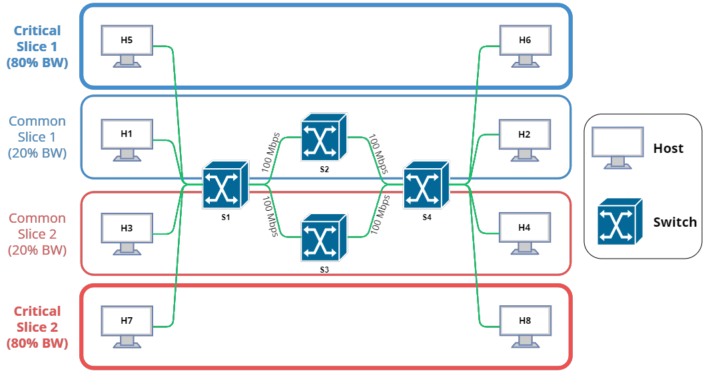

# On Demand SDN Slices in ComNetsEmu

        
        
        
        
        

# Table of contents

-   [Introduction](#introduction)
-   [Scenario 1 - Default](#scenario-1---default)
-   [Scenario 2 - Upper](#scenario-2---upper)
-   [Scenario 3 - Lower](#scenario-3---lower)
-   [Scenario 4 - All](#scenario-4---all)
-   [Scenario 5 - Broken](#scenario-5---broken)
-   [Installation and Configuration](#installation-and-configuration)
-   [Getting started - CLI](#getting-started---cli)
-   [Getting started - WebApp](#getting-started---webapp)
-   [Presentation](#presentation)
-   [Contacts](#contacts)

# Introduction

The goal of this project is to implement a network slicing approach to enable dynamic activation and deactivation of network slicing via CLI/GUI commands. To achieve this goal, five scenarios are proposed, each with the same network topology. The goal is to observe how the network responds to small or large changes in the different elements of the network.

The network topology is organized as follow:

- A SDN controller, `c1`.
- Four OpenFlow switches `s1-s4` with a fixed bandwidth of 100 Mbits/sec.
- Four slices, each containing two hosts for a total of eight, `h1-h8`. Two of these slices are common and require 20% of the available bandwidth, while the others are considered critical. This means that when these slices are activated and their hosts are connected, they require 80% of the available bandwidth. The slices are coupled based on the number. Therefore, slices 1 will communicate with switches s1, s2, and s4, while slices 2 will communicate with switches s1, s3, and s4. Of course, this is the normal operation of the network. In case of variations (e.g., a switch failure as happens in scenario 5), they can lead to changes in the packet flow.

    

# Scenario 1 - Default

### Overview

In this scenario, there are four hosts and four switches. The two common slices are activated, which means that they are able to use the maximum bandwidth available of 100 Mbits/sec.

    

### Demonstration

By running `pingall` command, it will show which hosts can be reached by a single host and this output will reflect the network structure described above. If you would like more information about how packets sent by the hosts are forwarded through the network, you can execute `dpctl dump-flows` to view the flow table.

    

 

In addition, to verify the accuracy of the network bandwidth, you can check the bandwidth between two hosts via `iperf <host1> <host2>` command.

    
     
     
    

 

> **Note**: the ***real bandwidth*** may vary from the ***theoretical bandwidth***.

# Scenario 2 - Upper

### Overview

In this scenario, there are six hosts and four switches. The two common slices and the critical slice 1 have been activated. However, only common slice 1 is able to use the maximum bandwidth of 100 Mbits/sec. This is because the bandwidth available to common slice 1 has been reduced due to the activation of critical slice 1. Therefore, common slice 1 can only access a bandwidth of 20 Mbits/sec (20%), while critical slice 1 has access to 80 Mbits/sec (80%).

    

### Demonstration

By running `pingall` command, it will show which hosts can be reached by a single host and this output will reflect the network structure described above. If you would like more information about how packets sent by the hosts are forwarded through the network, you can execute `dpctl dump-flows` to view the flow table.

    

 

In addition, to verify the accuracy of the network bandwidth, you can check the bandwidth between two hosts via `iperf <host1> <host2>` command.

    
     
     
    
     
     
    

 

> **Note**: the ***real bandwidth*** may vary from the ***theoretical bandwidth***.

# Scenario 3 - Lower

### Overview

This scenario is similar to the previous one, except that in this case, the bandwidth reduction has affected common slice 2 instead of common slice 1. This reduction is due to the activation of critical slice 2.

    

### Demonstration

By running `pingall` command, it will show which hosts can be reached by a single host and this output will reflect the network structure described above. If you would like more information about how packets sent by the hosts are forwarded through the network, you can execute `dpctl dump-flows` to view the flow table.

    

 

In addition, to verify the accuracy of the network bandwidth, you can check the bandwidth between two hosts via `iperf <host1> <host2>` command.

    
     
     
    
     
     
    

 

> **Note**: the ***real bandwidth*** may vary from the ***theoretical bandwidth***.

# Scenario 4 - All

### Overview

This scenario combines the Upper and the Lower ones. In fact, this time the bandwidth reduction affects both common slices due to the activation of both critical slices.

    

### Demonstration

By running `pingall` command, it will show which hosts can be reached by a single host and this output will reflect the network structure described above. If you would like more information about how packets sent by the hosts are forwarded through the network, you can execute `dpctl dump-flows` to view the flow table.

    

 

In addition, to verify the accuracy of the network bandwidth, you can check the bandwidth between two hosts via `iperf <host1> <host2>` command.

    
     
     
    
     
     
    
     
     
    

 

> **Note**: the ***real bandwidth*** may vary from the ***theoretical bandwidth***.

# Scenario 5 - Broken

### Overview

In this scenario, switch 3 breaks, and as a result, all network traffic needs to be routed through switch 2. This will result in a reduction of available bandwidth for all four slices, with critical slices having a bandwidth of 40 Mbits/sec (40%) and common slices having a bandwidth of 10 Mbits/sec (10%).

    

### Demonstration

By running `pingall` command, it will show which hosts can be reached by a single host and this output will reflect the network structure described above. If you would like more information about how packets sent by the hosts are forwarded through the network, you can execute `dpctl dump-flows` to view the flow table.

    

 

In addition, to verify the accuracy of the network bandwidth, you can check the bandwidth between two hosts via `iperf <host1> <host2>` command.

    
     
     
    
     
     
    
     
     
    

 

> **Note**: the ***real bandwidth*** may vary from the ***theoretical bandwidth***.

# Installation and Configuration

### Virtual Machine

Follow the instruction available at this [link](https://www.granelli-lab.org/researches/relevant-projects/comnetsemu-labs). Once installed, you will need to follow these additional steps:

1. Locate the newly installed VM labeled "*Comnetsemu Ubuntu Stand alone*". Click on the **Settings button** for this VM, and then navigate to the **Network tab**. Once there, select **Adapter 1** and click on the **Advanced button**. From the dropdown menu, select **Port Forwarding**. Next, add the following two rules:

   * `Name: SSH, Protocol: TCP, Host Port: 2222, Guest Port 22`.
   * `Name: SOCKET, Protocol: TCP, Host IP: 127.0.0.1, Host Port: 2223, Guest Port: 2223`.

   The first one is used to allow the Web Application on the host machine to connect via ssh to the VM. The second one is used for the socket used for the communication between the Mininet network and the Web Application.
     You should get something like this:
   

    

2. Copy the [OnDemandSDNSlices](OnDemandSDNSlices) folder inside the VM or, alternatively, you can copy and paste this command to do it automatically: `git clone https://github.com/christiansassi/networking-2-project.git && cd networking-2-project && mv OnDemandSDNSlices .. && cd .. && sudo rm -r networking-2-project && cd OnDemandSDNSlices`.
3. Go to [scenarios](OnDemandSDNSlices/scenarios) folder and type `chmod +x *.sh`.

> **Note**: the VM must be ON during the entire utilization of the Web Application.

### WebApp

1. Copy the [WebApp](WebApp) folder inside the VM.
2. Install the required python packages by running `pip install -r requirements.txt` inside the [WebApp](WebApp) folder.
3. Put the path of the [launcher.py](OnDemandSDNSlices/network/launcher.py) script (**which is in the VM**) in the `LAUNCHER_PATH` variable of the [master.py](WebApp/master.py) script.

> **Note**: if you are logging as **vagrant** inside the VM, change the values of the `SSH_USERNAME` and `SSH_PASSWORD` variables to "*vagrant*" in the [master.py](WebApp/master.py) script.

# Getting Started - CLI

It's possible to try and test the project via CLI. In order to do that, start the Mininet network by executing the following commands:

1. Navigate to the [network](OnDemandSDNSlices/network) folder and execute `ryu-manager controller.py`. This command will start the controller.
2. In another terminal window, navigate to the [network](OnDemandSDNSlices/network) folder and execute `sudo python3 topology.py` and wait until you see the `mininet >` terminal. This command will start the Mininet network in CLI mode.
3. In another terminal window, navigate to the [scenarios](OnDemandSDNSlices/scenarios) and run the scenario of your choice by executing the corresponding **.sh* file. This script will setup the network to the desired scenario.

You are now free to try any command you wish. Simply type `help` to see a list of all available commands. Once you are done, digit `exit` in the mininet terminal.

> **Note**: if you encounter any issues while running `topology.py`, try clearing everything by executing `sudo mn -c`. Additionally, ensure that the controller is running before starting Mininet.

# Getting Started - WebApp

Alternatively, instead of using the CLI interface, you can test the Mininet network by connecting to the Web Application and using the provided GUI. In order to do that, start the Web Application by following these steps:

1. Navigate to the [WebApp](WebApp) folder and execute `python WebApp.py` or `python2 WebApp.py` or `python3 WebApp.py` depending on your python version and operating system.
2. Now, open your browser and navigate to http://127.0.0.1:5000. 

> **Note**: the port may vary depending on the processes running on your system.

  
   
  <i>VM offline</i>

 

  
   
  <i>Mininet network OFF</i>

 

  
   
  <i>Loading screen</i>

 

  
   
  <i>Mininet network ON</i>

 

  
   
  <i>Overview</i>

 

The Web Application provides the ability to perform the following operations:

- Turn the Mininet network ON/OFF by clicking the switch button located in the top left corner of the page.
- Change the scenario. The Mininet network loads the default scenario when started. Clicking on the other buttons allows you to load one of the previously described scenarios.

Moreover, you can view the following informations:

- The color of the circle in the last column of the table indicates the currently active host or switch.
- Theoretical and real bandwidth. These informations can provide insights into how the network operates. It's important to note that the two bandwidth types aren't always equal.
- The diagram of the current scenario.

# Presentation

[Presentation](https://www.canva.com/design/DAFb2NEnqjY/-dY28hInsJRnf7H1ylJOug/view?utm_content=DAFb2NEnqjY&utm_campaign=designshare&utm_medium=link2&utm_source=sharebutton)

# Contacts

Pietro Bologna - [pietro.bologna@studenti.unitn.it](mailto:pietro.bologna@studenti.unitn.it)

Christian Sassi - [christian.sassi@studenti.unitn.it](mailto:christian.sassi@studenti.unitn.it)

